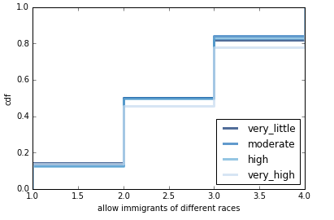

# Do More Politically Informed People Identify as Liberal?
## by Kevin Zhang
## 2/14/2017

##### Introduction:

In the United States, controversial debates generally devolve into a binary discourse, either liberal or conservative, left or right. One thing that liberals stereotypically assume about conservatives is that they are ignorant of the facts, that they just don't know what going on in the world, which is why their claims seem so alien. But does this stereotype hold up in other countries as well? As a person who identifies as liberal, I'm curious as to whether being more informed about politics and current affairs leads to being more liberal as a general principle, or whether it is just more of a mislead stereotype that is used by liberals to somehow advance their argument. The purpose of this article is find out whether that hypothesis is true.

##### Methodology:

For this article, I chose Europe as the main society of interest, because it is the next most advanced society that is similar to our political and social structure with a large population to collect data from. The data used in this experiment is obtained from the European Social Survey ([ESS](http://www.europeansocialsurvey.org/)), an organization that performs "biennial cross-national survey of attitudes and behaviour".

The dataset used is the ESS5, which is the survey performed in 2010. This particular survey is chosen because it's the most recent and complete dataset. How informed the population is quantified by the amount of time each day a respondent spends watching TV on politics and current affairs. Based on this [survey](http://ec.europa.eu/public_opinion/archives/eb/eb76/eb76_media_en.pdf) and this [data summary](http://ec.europa.eu/public_opinion/topics/fs7_communicating_40_en.pdf) by the Standard Eurobarometer of 2011, the European population uses TV the most out of any media outlet, and also uses it the most for learning about national politics and news. To evaluate the political standing of the respondents, the main category of a political spectrum from left to right will be used from the dataset, as well as various controversial topics that were asked as part of the survey. For more information on the variables used, take a look at this [website](http://www.europeansocialsurvey.org/downloadwizard/).

To find results for this experiment, I grouped respondents of the survey into 4 sections based on the amount of time they spend watching TV for politics or current affairs, and then compared these 4 sections against each other based on each section's overall standing in the political spectrum and political opinion on various topics. The main tools for analysis are Cumulative Distribution Functions ([CDF](https://en.wikipedia.org/wiki/Cumulative_distribution_function)) to compare the 4 sections to each other under various categories in the dataset, and calculation of the numerical mean of the 4 sections under each category (each category was asked based on a numerical scale). I also used the Cohen Effect Size to quantify the differences in opinions between the most informed and the least informed. The primary results are shown below.

For a deeper dive into the source code, check out my [ipython notebook](https://github.com/kzhang8850/ThinkStats2/blob/master/code/report1.ipynb).

##### Results and Interpretations:

The 2010 dataset contains over 35 million respondents across 15 different countries. I created Figure 1 by evaluating the four different groups described above under a political spectrum:

*Figure 1: A CDF plot showing the 4 groups plotted on a political spectrum.*

Figure 1 is a visualization of 4 CDFs which correspond to the 4 groups, as shown in the legend. The political spectrum ranges from 0 which is a completely leftist individual, to 10, which is a completely rightist individual. A 5 would be considered a moderate. Based on the graph, it is easy to tell that all 4 groups are all heavily rooted near the moderate region of the spectrum, as the largest jump in all the CDFs is near the 5. Once all the groups cross to the right of the moderate region, their patterns flip, as it seems that the "very_high" group has more of its distribution near the ends of the spectrum than it does near the middle in comparison to descending levels of informed groups. This would suggest that more informed people tend to be more polarized. In terms of liberal people being more informed, it seems that there is little relationship between the two. Figure 2 also serves to prove this:

*Figure 2: A table showing the means of the 4 groups on the political spectrum.*

As can be seen, there is little indication of a pattern of some sort in the means of the 4 groups, and any difference is less than 0.1 on a 0-10 scale which is a difference of less 1%, which isn't super substantial. The Cohen Effect Size is -.038, which further supports little difference between the two. It would appear that the assertion that the political spectrum showing a pattern among liberals and higher levels of information would be tenuous.

Other results further prove this idea. Figure 3 shows the category of agreeableness with the idea that science can solve our environmental problems:

*Figure 3: A CDF plot showing the 4 groups plotted on agreeableness with the notion that science can solve our environmental problems.*

Figure 3 is a visualization of 4 CDFs which correspond to the 4 groups, and the topic of science is evaluated on an agree/disagree answer spectrum from 1-5, with 1 being Extremely Agree and 5 being Extremely Disagree. As can be seen from the graph, the more informed groups tend to stay above the less informed groups, which mean that they have larger percentiles that answered lower numbers. Especially in the 2-3 region along the x-axis, the rankings of the 4 groups is most apparent. This means that the more informed the respondent is, the more likely he is going to agree with the notion that science can help save the environment, which is considered a liberal idea.

The result from Figure 3 would lend itself to the idea that the population might have a relationship between liberals and information, but the Cohen Effect Size is 0.12, which suggests that a small difference exists between the more informed and the less informed. Results on other topics support the idea of this small difference. Figure 4 shows a comparison of the 4 groups under the idea that immigrants of a different race should be allowed to live in the respondent's country:

*Figure 4: A CDF plot showing the 4 groups plotted on agreeableness with the notion that immigrants of a difference race can live in their country.*

The parameters for Figure 4 are the same as the previous ones. This time, there is no clear pattern in the plot, as the rankings of the groups change as they move from one end to the other. The more informed groups start out being more agreeable, but as the answer moves to higher numerical answers, the more informed groups become more disagreeable than the less informed groups. This pattern in the more informed groups, especially in the "moderate" and "high" groups, does seem to once again hint at the idea that being informed might actually relate slightly with becoming more polarized on political opinions. The overall analysis would suggest that there is little to no relationship between how informed a person is and whether they believe in this liberal policy. The Cohen Effect Size does turn out to be -0.0983, which suggests that the difference between the groups is pretty small.

##### Conclusion:

It does appear that there is no substantial relationship between how informed a person is and their political opinions. As seen by the graphs, there is no substantial difference between the less informed and the more informed, which the means and Cohen's Effect Sizes supported. This is a reasonable conclusion, as a person may not be necessarily be influenced by how much they are learning about politics and current affairs, but rather by internal factors such as personality and personal beliefs or external factors such as communities or how they were raised in the household. It is even possible that a large number of people watch a lot of conservative news, which would further debunk the hypothesis. One thing to potentially take away from the figures is that it is possible that being more informed might allow a person to become more polarized towards either the liberal or conservative ends. But this does seem to settle it: a more informed population doesn't mean that they are more liberal.

##### Limitations and Next Steps:

Evidently there are some shortcomings of the model and the data I chose to use. The biggest one would probably be the outdated information I'm using, which is almost a decade old now, and it is possible that people's opinions and habits change over time. It is also possible that my method for evaluating political leftness or rightness might be flawed, as I mainly look at specific topics that may or may not be bipartisan enough to make a point. It is also possible that the people of Europe identify in different ways than just liberal and conservative, which might effect the results of the experiment.

Some next steps would definitely be to try to find more up-to-date data on the European population, or even investigate other populations and see whether or not a younger, less developed country has the same results as in this analysis. Another idea would be to look into change over time, and potentially discover how population's opinions and habits evolve as the current events and politics around them unfold.

In any case, I believe this is a compelling statement that the amount of information that a person has at their disposal regarding current affairs or political news does not really sway them towards being more liberal individuals.
