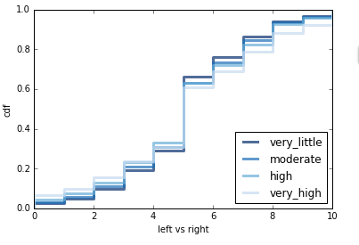
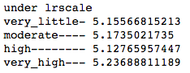
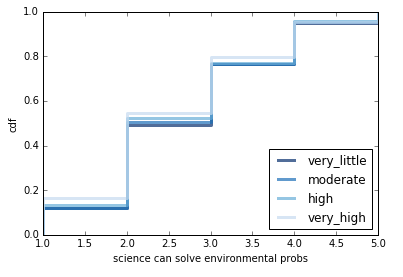
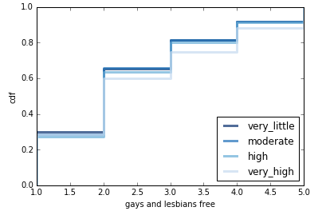
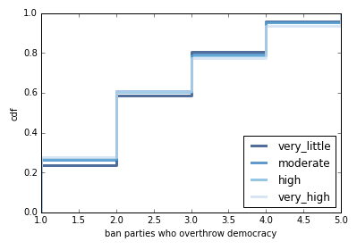

# Do More Politically Informed People Identify as Liberal?
## by Kevin Zhang
## 2/14/2017

Introduction:

With the recent current events going on in the United States, polarizing discussions can be sparked about pretty much anything with political ties these days, from global warming to abortions to gun control. In the United States, most of these debates fall into a binary discourse, either liberal or conservative, left or right. One thing that is stereotypically assumed by the liberals is that the conservatives are ignorant of the facts, that they just don't know what going on in the world, which is why their claims and arguments seem so "non-sensical" to liberals. For example, liberals believe that conservatives are crazy to think that global warming isn't real when there is so much evidence available, and maybe it's because they're not exposed to the data, that they are not informed. It is reasonable to assume this idea, since there is a large majority of the conservative population which reside in more rural areas far away from large cities and with little access to mediums of information dissemination. But does this stereotype hold up in other countries as well? As a person who identifies as liberal, a question of curiosity is whether being more informed about politics and current affairs leads to being more liberal as a general principle, or whether it is just more of a mislead stereotype that exists within American society. The purpose of this article is find out whether that hypothesis is true.

Methodology:

For this article, Europe was chosen as the main society of interest, because it is the next most advanced society that is similar to our political and social structure with a very large population to collect data from. The data used in this experiment was obtained from the European Social Survey ([ESS](http://www.europeansocialsurvey.org/)), an organization that performs "biennial cross-national survey of attitudes and behaviour".

The dataset used is the ESS5, which is the survey performed in 2010. This particular survey was chosen because it's the most recent and complete dataset. How informed the population is about politics about current affairs is quantified by the amount of time each day a respondent spends watching TV on politics and current affairs. Based on this [survey](http://ec.europa.eu/public_opinion/archives/eb/eb76/eb76_media_en.pdf) and this [data summary](http://ec.europa.eu/public_opinion/topics/fs7_communicating_40_en.pdf) by the Standard Eurobarometer of 2011, the European population uses the TV the most out of any media outlet, and also uses it the most for learning about national politics and news. To evaluate the political standing of the respondents, the main category of a political spectrum for left to right will be used from the dataset, as well as various controversial topics that were asked as part of the survey, such as immigration and homosexual rights. For more information on the variables used, take a look at this [website](http://www.europeansocialsurvey.org/downloadwizard/).

To find results for this experiment, the dataset was read into a Python Notebook, then cleaned and formatted properly. The respondents were grouped into 4 sections based on the amount of time they spent watching TV for politics or current affairs, and then these 4 sections were compared against each other based on each section's overall standing in the political spectrum and political opinion on various topics. The main tools for analysis were Cumulative Distribution Functions ([CDF](https://en.wikipedia.org/wiki/Cumulative_distribution_function)) to compare the 4 sections to each other under various categories in the dataset, and calculation of the numerical mean of the 4 sections under each category to further support the assertion that the data results show from the CDFs (each category was asked based on a numerical scale). The primary results are shown below.

For a deeper dive into my source code, check out my [ipython notebook](https://github.com/kzhang8850/ThinkStats2/blob/master/code/report1.ipynb).

Results and Interpretations:

The 2010 dataset contained over 35 million respondents across 15 different countries. Separated into 4 different groups based on amount of time spent watching TV for politics or current affairs, and then evaluated under a political spectrum creates the following graph:

The plot is a visualization of 4 CDFs which correspond to the 4 groups, as shown in the legend. The political spectrum ranges from 0 which is a completely leftist individual, to 10, which is a completely rightist individual. A 5 would be considered a moderate. Based on the graph, it is easy to tell that all 4 groups are all heavily rooted near the moderate region of the spectrum, as the largest jump in all the CDFs is near the 5. What's interesting is that once all the groups cross to the right of the moderates, their patterns flip, as the very_high group is considered more left but also considered more right. Along the same lines, the very_little group is considered less left but also less right. In terms of liberal people being more informed, it seems that there is little correlation between the two. The mean calculation also serve to prove this:

As can be seen, there is little indication of a trend of some sort in the means of the 4 groups, and any difference is less than 0.1 on a 0-10 scale which is a difference of less 1%, which isn't super significant. It would appear that the political spectrum would show that a trend among liberals and higher levels of information would be tenuous.

Other results also serve to prove this idea as well. The following graph uses the same 4 groups as the previous one but this time compares them in three different ways - under the idea of science, freedom for homosexuals, and a ban on parties that wish to overthrow democracy. This first graph shows a CDF plot of the 4 groups being evaluated under the category of agreeableness with the idea that science can solve our environmental problems:

The plot is a visualization of 4 CDFs which correspond to the 4 groups, and the topic of science is evaluated on a agree/disagree answer spectrum from 1-5, with 1 being Very Agree and 5 being Very Disagree. As can be seen from the graph, the "higher" groups tend to stay above the "lower" groups, which mean that they have larger percentiles that answered lower numbers. Especially in the 2-3 region along the x-axis, the rankings of the 4 groups is very apparent. This means that the more informed the respondent is, the more likely he is going to agree with the notion that science can help save the environment, which is considered a pretty liberal idea.

The result from the science category would lend itself to the idea that the population might have a positive correlation between liberals and information, however results on other topics prove otherwise. The next graph compares the same 4 groups under whether they agree with the idea that homosexuals should be given the freedom to live their lives as they wish:

The plot is once again 4 CDFs plotted against each other, and the scale for this category is the same as the one for the science topic. In this graph, the 4 groups seem to be ranked in the opposite pattern as the one before, with the "lower" groups floating above the "higher" groups, which means that a larger percentile of less informed people agreed to this idea than more informed people. Especially in the 2-4 region along the x-axis, this ranking is evident. Interestingly enough, it seems that regarding homosexuals, more informed people in Europe would less likely to agree that they should be allowed to live as they wish than less informed people, which considering that this idea is highly liberal, is very intriguing.

Lastly, there are some topics that completely confuse the notion that any correlation exists at all. This final graph shows a comparison of the 4 groups under the idea that political parties which advocate for the removal of democracy should be banned:

The parameters for this graph are the same as the previous ones. This time, there is no clear trend in the plot, as the rankings of the groups change as they move from one end to the other. The "higher" groups start out being more agreeable, but as the answer moves to more Disagree, the "higher" groups become more disagreeable than the "lower" groups. This is especially evident in the middle region. This would suggest that there is little to no correlation between how informed a person is and whether they believe in the banning of political parties.

Conclusion:

It does appear that there is no significant correlation between how informed a person is and their political opinions. As seen by the political spectrum graph, there was no statistically significant difference between the less informed and the more informed, which the means supported. The three following graphs on various controversial topics also suggested that a general correlation across the board may not be feasible. This is a reasonable conclusion, as a person may not be necessarily be influenced by how much they are learning about politics and current affairs, but rather by internal factors such as personality and personal beliefs or external factors such as communities or how they were raised in the household. It is even possible that a large number of people watch a lot of conservative news, which would further debunk the hypothesis. One thing to potentially take away from the graphs is that it is possible that being more informed might allow a person to become more polarizing or become more opinionated, not necessarily in towards the liberal side though. At this point it seems tentatively settled: a more informed population doesn't mean that they are more liberal.

Limitations and Next Steps:

Evidently there are some shortcomings of the model and the data I chose to use. The biggest one would probably be the outdated information I'm using, which is almost a decade old now, and it is possible that people's opinions and habits change over time. It is also possible that my method for evaluating political leftness or rightness might've been flawed, as I mainly looked at specific topics that may or may not be controversial enough to make a point. It is also possible that the people I was looking for separating into groups by is not the correct or most representative group to be using, as TV in 2017 is a pretty outdated medium, and most of the population would probably get their news from the internet now.

Some next steps would definitely be to try to find more up-to-date data on the European population, or even investigate other populations and see whether or not a younger, less developed country has the same lack of patterns as in this analysis. Another idea would be to look into change over time, and potentially discover how population's opinions and habits evolve as the current events and politics around them unfold.

In any case, I think this is a pretty compelling statement that the amount of information that a person has at their disposal regarding current affairs or political news does not really affect their political standing or opinions.
