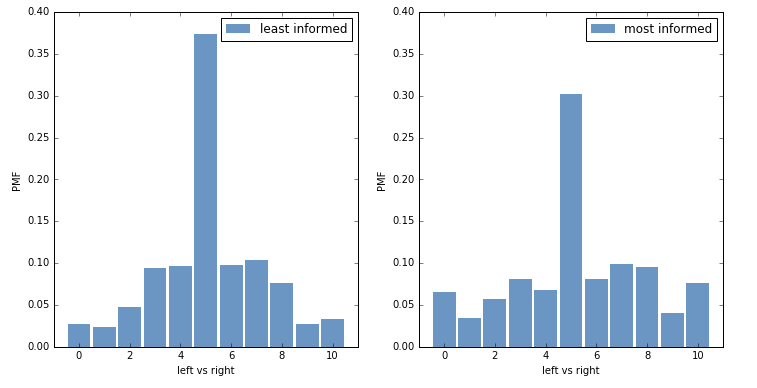

# Do More Politically Informed People Identify as Liberal?
## by Kevin Zhang
## 2/24/2017

##### Introduction:

In the United States, controversial debates generally devolve into a binary discourse, either liberal or conservative, left or right. One thing that liberals stereotypically assume about conservatives is that they are ignorant of the facts, that they just don't know what going on in the world, which is why their claims seem so alien. But does this stereotype hold up in other countries as well? As a person who identifies as liberal, I'm curious as to whether being more informed about politics and current affairs leads to being more liberal as a general principle. The purpose of this article is find out whether that hypothesis is true.

##### Methodology:

For this article, I chose Europe as the main society of interest, because it is the next most advanced society that is similar to our political and social structure with a large population to collect data from. The data used in this experiment is obtained from the European Social Survey ([ESS](http://www.europeansocialsurvey.org/)), an organization that performs a "biennial cross-national survey of attitudes and behaviour".

The dataset used is the ESS5, which is  the survey performed in 2010. This particular survey is chosen because it's the most recent and complete dataset. How informed the population is quantified by the amount of time each day a respondent spends watching TV on politics and current affairs. Based on this [survey](http://ec.europa.eu/public_opinion/archives/eb/eb76/eb76_media_en.pdf) and this [data summary](http://ec.europa.eu/public_opinion/topics/fs7_communicating_40_en.pdf) by the Standard Eurobarometer of 2011, the European population uses TV the most out of any media outlet, and also uses it the most for learning about national politics and news. To evaluate the political standing of the respondents, the main category of a political spectrum from left to right will be used from the dataset. For more information on the variables used, take a look at this [website](http://www.europeansocialsurvey.org/downloadwizard/).

To find results for this experiment, I grouped respondents of the survey into 4 sections based on the amount of time they spend watching TV for politics or current affairs, and then compared these 4 sections against each other based on each section's overall standing in the political spectrum. The four groups are "very_low" (0-.5 hrs), "moderate" (.5-1.5 hrs), "high" (1.5-2.5 hrs), and "very_high"(2.5+ hrs). The main tools for analysis are Cumulative Distribution Functions ([CDF](https://en.wikipedia.org/wiki/Cumulative_distribution_function)) and Probability Mass Functions ([PMF](https://en.wikipedia.org/wiki/Probability_mass_function)) to compare the 4 sections to each other under various categories in the dataset, and calculation of the numerical mean of the 4 sections under each category (each category was asked based on a numerical scale). I also used the Cohen Effect Size to quantify the differences in opinions between the most informed and the least informed. The primary results are shown below.

For a deeper dive into the source code, check out my [ipython notebook](https://github.com/kzhang8850/ThinkStats2/blob/master/code/report1.ipynb).

##### Results and Interpretations:

The 2010 dataset contains over 35 million respondents across 15 different countries. I created Figure 1 by evaluating the four different groups described above under a political spectrum:

*Figure 1: A CDF plot showing the 4 groups plotted on a political spectrum. The Cdfs do not really show a trend where the higher groups are consistently higher than the lower groups on the graph, but rather they flip patterns once they pass the moderate region, such that the higher groups are lower than the lower groups on the graph after 5 on the scale. This could potentially mean that the more informed groups are more polarized to either side, not just one.*

Figure 1 is a visualization of 4 CDFs which correspond to the 4 groups, as shown in the legend. The political spectrum is based on the LR Scale, which ranges from 0 which is a completely leftist individual, to 10, which is a completely rightist individual. A 5 would be considered a moderate. Based on the graph, it is easy to tell that all 4 groups are all heavily rooted near the moderate region of the spectrum, as the largest jump in all the CDFs is near the 5. Once all the groups cross to the right of the moderate region, their patterns flip, as it seems that the "very_high" group has more of its distribution near the ends of the spectrum than it does near the middle in comparison to descending levels of informed groups. This would suggest that more informed people tend to be more polarized. In terms of liberal people being more informed, it seems that there is little relationship between the two. This is a possible conclusion, as people may watch a lot of conservative news or just watch for entertainment without much thought to developing strong opinions. There are a number of reasons why people might not necessarily jump to liberalism because they know information, as the counterargument to the hypothesis would be that just because a person watches a lot of political news does not mean that they know what to do with it or choose to act on it. Figure 2 also serves to prove this:

| Group | LR Mean |
| ------ | ----------- |
| Very Little   | 5.156|
| Moderate | 5.173 |
| High    | 5.128|
| Very High | 5.234|

*Figure 2: A table showing the means of the 4 groups on the political spectrum. As can be seen, the means have no particular trend or pattern that shows anything relating to the idea that more informed are more liberal, since they are pretty random without any inclination of showing a downwards trend.*

As can be seen, there is little indication of a pattern of some sort in the means of the 4 groups, and any difference is less than 0.1 on a 0-10 scale which is a difference of less 1%, which isn't super substantial. The Cohen Effect Size is -.038, which further supports little difference between the two. It would appear that the assertion that the political spectrum showing a pattern among liberals and higher levels of information would be tenuous.

Although the initial hypothesis seems a little weak now, it appears that we have found something else that is equally as interesting. Figure 3 shows the PMF graphs of the least informed group, "very_low", and the most informed group, "very_high", based on the group's responses to the LR Scale:

 *Figure 3: A side-by-side PMF plot comparison zooming in on the least informed group, "very_low" with the most informed group, "very_high", under the LR Scale. As can be seen, the "very_low" group is more highly concentrated around the moderate 5 region, whereas the "very_high" group is more evenly distributed around the spectrum. This proves the idea that the more informed group is more polarized, as they have more people trending towards the polar ends of the political spectrum.*

Figure 3 is a visualization of two PMFs for the "very_low" and "very_high" groups side by side for a qualitative comparison of their distributions based on the LR Scale graph above. As can be seen from the graph, the "very_low" PMF is more highly concentrated around the 5 region, where the moderates would identify. The "very_high" PMF, however, seems to be more evenly distributed, with a smaller peak at 5 and a more uniform distribution around the moderate region. This implies that the most informed group tends towards the more polar ends of the political spectrum, which suggests that more informed people are more polarized. There is reason to believe this, as a possible explanation could be that people who have more information at their disposal are more likely to foster more partisan opinions than those who know much less and thus don't have enough information to really do much else except stay in the moderate region. As further proof as well against the original hypothesis, the more informed group barely shows any difference from the less informed group in terms of trending towards smaller numbers which represent liberalism, suggesting very little correlation towards a more leftist mindset from the least informed group to the more informed group.

To further this idea quantitatively, Figure 4 shows a table containing the standard deviation for each of the 4 groups under the LR Scale:

| Group | LR Standard Deviation |
| ------ | ----------- |
| Very Little   | 2.097|
| Moderate | 2.210 |
| High    | 2.353|
| Very High | 2.631|

*Figure 4: A table showing standard deviations for each of the four groups regarding their distribution for the LR Scale. There is a clear trend of more information showing a higher standard deviation, which means that the distribution is more spread out around the mean, which in turn means that the more informed groups are more polarized.*

The standard deviations in Figure 4 are calculated based on each individual group's distribution regarding the LR Scale. This time, there is a very clear trend in the data, where each successively more informed group has a higher standard deviation, which means that the more informed a group is, the more spread out around the mean they are, which in turn means that they have wider, more even distributions. This pattern once again hints at the idea that being informed might actually relate with becoming more polarized on political opinions. It is apparent, both quantitatively and qualitatively, that people who are more informed tend to have stronger political opinions.

##### Conclusion:

It does appear that there is no substantial relationship between how informed a person is and their political leftness. As seen by the LR Scale graph, there is no substantial difference between the less informed and the more informed in regards to this, which the means and Cohen's Effect Sizes supported. This is a reasonable conclusion, as a person may not be necessarily be influenced by how much they are learning about politics and current affairs, but rather by internal factors such as personality and personal beliefs or external factors such as communities or how they were raised in the household. It is even possible that a large number of people watch a lot of conservative news, which would further debunk the hypothesis. One thing to potentially take away from the figures is that it is possible that being more informed might allow a person to become more polarized towards either the liberal or conservative ends. The PMFs and standard deviations among the four groups do give a not confirmed but compelling reason to believe that people are more polarized when they watch more news on TV. But this does seem to settle it: a more informed population doesn't mean that they are more liberal, but perhaps just more thoughtful and able to give deliver a more partisan, more representative vote.

##### Limitations and Next Steps:

Evidently there are some shortcomings of the model and the data I chose to use. The biggest one would probably be the outdated information I'm using, which is almost a decade old now, and it is possible that people's opinions and habits change over time. It is also possible that the people of Europe identify in different ways than just liberal and conservative, which might effect the results of the experiment.

Some next steps would definitely be to try to find more up-to-date data on the European population, or even investigate other populations and see whether or not a younger, less developed country has the same results as in this analysis. Another idea would be to look into change over time, and potentially discover how population's opinions and habits evolve as the current events and politics around them unfold.

In any case, I believe this is a compelling statement that the amount of information that a person has at their disposal regarding current affairs or political news does not really sway them towards being more liberal individuals, but rather could potentially empower them enough to develop more opinionated ideas in general.
