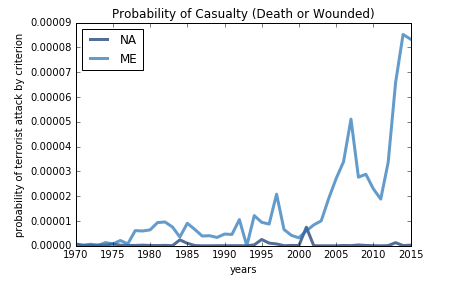
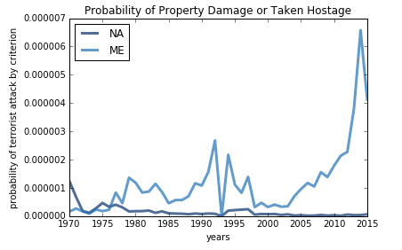

# What's the Chance You will Die to Terrorism?
## by Kevin Zhang
## 3/24/2017

Especially in recent years, Western fear of terrorism and paranoia toward specific regions in the Eastern Hemisphere, particularly the Middle Eastern region, has on the rise. Now, the government are voicing for controversial bills such as travel bans on Middle Eastern countries, and some people are publicizing discriminatory acts towards people associated with a Middle Eastern country. The supporters' argument is that this is protect against the possibility of another "9/11-like" catastrophe, for the sake of national security. Critics argue it's unconstitutional because it's prejudice towards a single religion. As a resident of the United States, and hearing the plight of the innocent Middle Eastern citizens, I've become curious as to the actual chances of a terrorist attack happening in my hometown. What are the chances that a given person in the United States will be the victim of a terrorist attack? And perhaps more importantly, how does it compare to that of the Middle East? The purpose of this article is to answer this two-part question.

##### Methodology:

To answer the question, I found two databases of interest: the [Global Terrorism Database](https://www.start.umd.edu/gtd/), and the [World Bank Population Database](http://data.worldbank.org/indicator/SP.POP.TOTL). The Global Terrorism Database is claimed to the most comprehensive database on terrorism in the world, with virtually every documented incident of terrorist around the world dating from 1970 to 2015. The World Bank database is a database that holds the population of every country in the world by year, from the 1960s to present time.

I decided to define "a victim of terrorism" by four of the variables found in the GTD database, which were for a given incident, the number dead, the number wounded, property damage, and hostage situation. The dead and wounded categories were numerical values, and property damage and hostage situation were binary values that denoted whether that criterion occurred in the given incident or not. I deemed that these were sufficient because they cover a wide breadth of various results that can occur during terrorist incident, such as whether people were harmed, whether the surrounding environment was harmed, and whether things escalated to become "complicated".

To calculate the chance of a given person being a victim, I decided to derive the probability of terrorism per capita. In other words, for a given year in a given region, I would total up the number of kills, wounded, and instances of damage or hostages, and then divide them all by the total population of the region in that year. I would do this for almost 50 years, from 1970 to 2015, to not only show what the chance is but also how it evolved over time. With this idea, I'm basically finding how many people will be affected by a criterion of terrorism out of the entire population of people in the region.

The main concepts used for analysis were Probability Mass Functions, Time Series analysis, and probabilistic analysis, which were deemed enough for the purposes of this project.

To explore the variables in the GTD database in detail, check out the [documentation](https://www.start.umd.edu/gtd/downloads/Codebook.pdf)

For a deeper dive into the source code, check out my [ipython notebook](https://github.com/kzhang8850/ThinkStats2/blob/master/code/report2.ipynb).

I calculated the probabilities for deaths and wounded separately from property damage and hostage situations, due to the nature of the variables. To begin, Figure 1 below was created by calculating the chance of being physically harmed by a terrorist over time.

*Figure 1: A time series graph showing the probability of being harmed by a terrorist both in North America and the Middle East. The NA line almost 0 has been for the past 40 years, which suggests that the average person in the US has an extremely low chance of being harmed from a terrorist attack. The ME line reaches closer towards .00008, which is tangibly higher than the NA line, however looking at this value alone, it too is extremely small, so in both regions the chance of being hit by a terrorist incident is close to nothing. *

Figure 1 shows a time series graph qualitatively displaying the probabilities for being harmed by a terrorist incident in both the North America (NA) and Middle East (ME) regions. Immediately upon seeing it, it is clear that the ME region has significantly higher probabilities than the NA region, which is consistent over time. Note that the large spike in the ME graph, which is correlated with the only major spike in the NA graph, is most likely due to the 9/11 attack which occurred in 2001. That potentially might've led to a surge in terrorism in the Middle East, as insurgents rallied behind the event. The NA graph basically hugs the x-axis for the entire duration of the past 50 years, meaning that the chance of being hit by a terrorist in the US is nearly improbable. In comparison, the ME graph has a more tangible result, reaching up to .00008, which is greater than the NA graph. In this sense, this result does lend some reasoning to the growing fear of the US people, as it is clear from this graph that terrorists are much more common in the ME region, so there is a "higher" chance that a given person affiliated with that region might be a terrorist. However, looking at the ME graph on its own, the probability at any given time in history is less than .01%. Even though the Middle East does have a higher chance of experiencing terrorism, the chance of being hit by a terrorist incident in both regions is close to nothing.

To more quantitatively display the results above, Figure 2 below shows the derivation and direct comparison of the probabilities for the two regions for the most recent year of available data, 2015.

||                    Casualties (2015)                         ||
| :------: | :----: | :-------:|
|North America | Middle East | Difference |
| 1 in 4,139,212 | 1 in 11,997 | NA is 345 times greater|

*Figure 2: A table which shows the most recent probabilities of being attacked by a terrorist and being harmed, which can be deemed the most relevant to the people of the current era. Note that while the Middle East probability looks much smaller larger than that the North America probability, it by itself is still quite small as a probability. This suggests that the paranoia around the Middle East does have some reasoning backed by data, but the extremely small values still point toward irrational reactions from the people.*

Figure 2 is a table that shows a direct comparison between the most recent probabilities, calculated for 2015. As can be seen, the ME region's probability is indeed much larger than that of the NA region's. In fact, the NA region's probability is two orders of magnitude smaller than that of the ME region's. However, looking at the ME probability alone, it is still a quantitatively small value. To give a sense of comparison, this [website](http://www.alternet.org/personal-health/20-things-are-most-likely-kill-you-hint-not-sharks-or-terrorists) provides some events that have probabilities higher than that of the probability of being harmed by terrorism. While the credibility of the statistics given in the article aren't necessarily confirmed, one could easily search for statistics that provide methodology and come up with comparable results, and in any case, these statistics are meant just to provide a reference point for how small the numbers in Figure 2 are. Looking at the "reference" website above, dying to drowning or a fire is more probable than dying to terrorism in the Middle East, currently dubbed the center of terror, where all the civil wars, major terrorist groups, and death lie. North Americans have almost the same probability as being killed by an asteroid as being killed by terrorism.

To provide another perspective to this question, Figure 3 below was created by calculating the chance of being a victim to property damage or a hostage situation by a terrorist over time.

 *Figure 3: A time series graph showing the probability of being a victim or property damage or a hostage situation by a terrorist both in North America and the Middle East. The NA line has been consistently decreasing over time to almost 0, suggesting that NA has almost no chance of having property damaged or hostages taken as well. The ME line shows a similar trend as with the casualty graph, and this time is also significantly higher than that of the NA graph, but the ME graph this time peaks around .000006, an order of magnitude lower than its casualty graph. This once again supports the idea that while the ME region feels terrorism more than NA, in the end the average person is still both very unlikely to be hit by terrorism.*

Figure 3 is another time series graph, this time showing the two regions for the binary variables of whether the incident included property damage or a hostage situation. As can be seen, once again the trends and comparison between the ME region and NA region are similar to that of the casualty graph, where the ME graph is higher than that of the NA graph, and shows an increasing trend, whereas this time the NA graph actually shows a small decreasing trend over time. However, the major difference this time is to notice the y-axis scale. It's actually an entire order of magnitude lower than that of the casualty graph.  This means that the probability of a person in the Middle East having their property damaged or becoming a hostage is even lower than them just being killed. This is sensible, because in the case of terrorist incidents, most terrorists could be looking to kill specific targets or just kill in general rather than break buildings or take people hostage, which becomes a complicated situation. This result also states with additional likelihood that the probability of being affected by terrorism in either region is extremely low.

Looking at Figure 3 in a quantitative manner, Figure 4 below shows the derivation and direct comparison of the probabilities for the two regions for the most recent year of available data, 2015.

||                   Damage or Hostage (2015)                         ||
| :------: | :----: | :-------:|
|North America | Middle East | Difference |
| 1 in 15,622,187 | 1 in 242,492 | NA is 64 times greater|

*Figure 4: A table which shows the most recent probabilities of being a victim of property damage of a hostage situation by a terrorist. Notice that once again the ME region has a higher probability, but this time the difference between the two is much smaller, only about one order of magnitude apart. In addition, the probabilities this time are much smaller than for casualties, showing the chance for this criterion is especially low. This further supports the idea that people have unfounded fears towards the Middle East, and that their actions towards citizens associated with that region are irrational.*

This figure show another table, this time for the property damage or hostage criterion. Once again it can now numerically seen that the ME region does indeed hold a higher probability than the NA region for being affected by terrorists. However, the difference between the two is smaller this time, only 64 times instead of 345. In addition, the probabilities for this criterion are even lower than that of the casualty, as seen qualitatively in the graph. Focusing on the numbers by themselves, it is quite clear that they are extremely small. Looking at the "reference" [website](http://www.alternet.org/personal-health/20-things-are-most-likely-kill-you-hint-not-sharks-or-terrorists) again, the comparisons become even more outrageous. For the Middle East, a person is more likely to experience a dog attack or an earthquake than have their property damaged by a terrorist. For the United States, a person could die from fireworks more easily than have their property damaged or become a hostage to a terrorist.

Based on this data, it is reasonable to suggest that while there may be some plausibility in the argument of the supporters of the travel ban and threats towards Middle Eastern citizens, the data overwhelming shows that the chance a person in the center of the terror zone is affected by terrorism is extremely low, and the chance of a person in the US being affected is even way lower than that. The data suggests that the actions of towards Middle Eastern citizens could potentially be said to be irrational or unfounded.

##### Limitations and Next Steps:

Evidently there are some shortcomings of the model and the data I chose to use. The GTD database particular, could potentially be incomplete in some ways. While the variables I used were mostly well documented, there was a good amount of the database that contained missing data, so it's highly possible that some things were mis-recorded or that incidents were missing. In addition, my quantitative analysis could've potentially dived deeper to see distributions or standard deviations of the probabilities, which might've made the results more clear. In addition, this analysis assumes both domestic terrorism and foreign terrorism lumped together as a singular entity, whereas in reality they are quite different. That could've been a potential confounding variable that the GTD database did have answer to, and had it been addressed might've led to more conclusive or interesting results.

Some next steps would be to see if it's possible to differentiate between foreign and domestic terrorism, which might be an area of interest. Another idea would be to explore other regions with this same approach and see what comes of it. Finally, potentially diving deeper into more quantitative analysis onto the probabilities might yield better results.

In any case, I believe this is a compelling statement that the chance of the average person being affected by terrorism in the US is close to 0, while slightly higher, the reality is that the Middle East can say the same thing.
