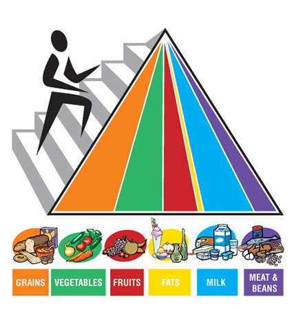
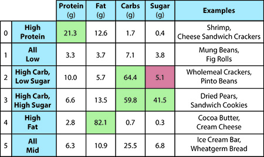
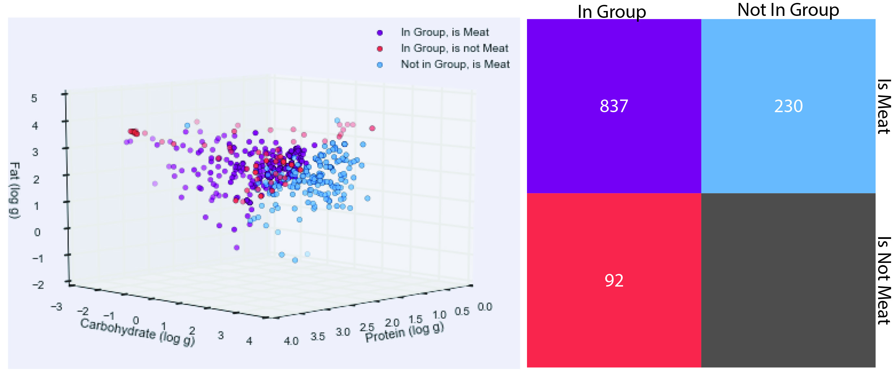
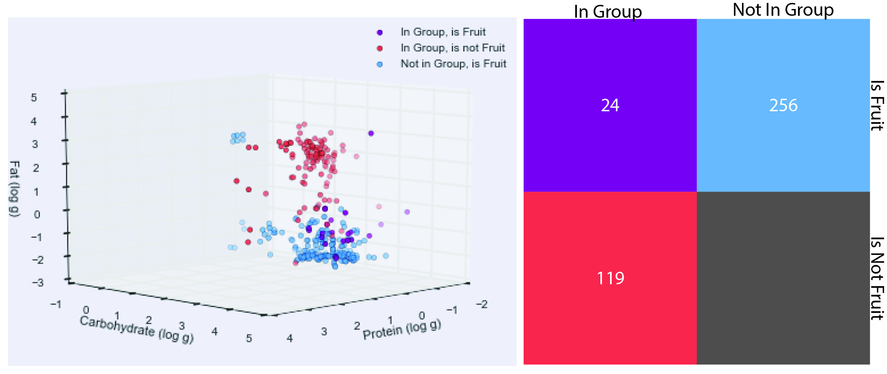
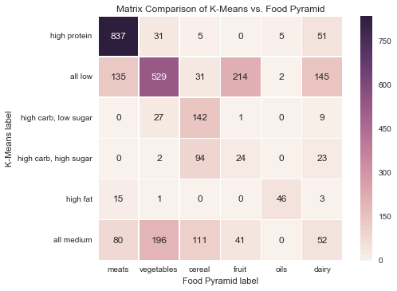
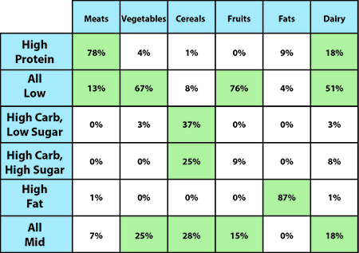

# Should you Follow the Food Groups for Dietary Advice?

#### Kaitlyn Keil and Kevin Zhang

#### Data Science Spring 2017

  

*Figure 1: The Food Pyramid, with the 6 basic food groups and their servings sizes. This is the staple reference point of many diets as well as a source of disillusionment due to its constant appearance in the grade school education system.*

Beginning from childhood, most of us who participated in the education system have been taught the Food Pyramid, consisting of six basic food groups: Grains, Vegetables, Fruits, Meats, Dairy, and Fats/Oils. The categorization, interactions, and suggested serving sizes of these groups are shown in Figure 1 above. As people grow up and we learn more about food science, some decide that the Food Pyramid is outdated and develop their own balanced diet, while others follow it like the Food Bible, portioning their meals strictly according to the servings listed. This controversy over social acceptance of the Food Pyramid surfaces an important question: are the food categories found in the Food Pyramid truly the correct groupings for food, and if not, just how far off are they?

To answer the question, we utilize the [United Kingdom Nutrient Databank](http://tna.europarchive.org/20110116113217/http://www.food.gov.uk/science/dietarysurveys/dietsurveys/), created by the Food Standards Agency in 2002. This database is a relatively recent and extensive publication of the composition of common foods consumed in the UK. It contains over 3000 foods and outlines their nutrient content, from macronutrients (i.e. fat, carbohydrates, etc) to vitamins and minerals to even trace elements. This compositional information is often used to inform food choices and create personalized meal plans, thus lending itself to being used for categorization. The databank also includes most staple foods as well as popular foods from the previous decade, making it a relevant and powerful dataset in terms of the question.

For more information on the database used, check out the [UK's website.](http://tna.europarchive.org/20110116113217/http://www.food.gov.uk/multimedia/pdfs/cofuserdoc.pdf)

To evaluate the "correct" groupings of food, which is inherently subjective, we define groups to be correct if they share similar compositions. In other words, if their nutrient content and biological characteristics are comparable, we consider them to be part of the same category. In line with the way the Food Pyramid categorizes food, we will be using the major macronutrients to categorize food. This means we will be using the amount of carbohydrates, fats, and proteins in a given amount of food, as well as sugar content since it's also an important factor in dietary choices. Each entry in the databank is based off of a 100 g portion of the food.

We will be using [K-Means Clustering](https://github.com/jakevdp/PythonDataScienceHandbook/blob/master/notebooks/05.11-K-Means.ipynb) as the principle tool to see if the Food Pyramid's food groups are correct. The K-Means algorithm will search for 6 clusters, the supposed 6 major food groups, based on the macronutrient criteria through an unsupervised learning approach. Then using the 6 groups found by the K-Means algorithm which it believes are the 6 real groups based on nutrient content, we will compare them against the 6 food groups defined by the Food Pyramid to see how similar they are. In addition, we will also be using accuracy scores of K-Means predictions and confusion matrices to more quantitatively look into the similarities between the categorizations of the two groups.

  

*Figure 2: The six groups found by the K-Means clustering, labeled by the average values of macronutrient composition. A couple of examples for each category is shown in the final column. Note that the average composition of each group defines each one fairly well into one of 6 categories, and the examples are quite consistent with the defined categories.*

We ran the K-Means algorithm on the UK Nutrient Databank, and discovered that the food groups from the Food Pyramid aren't as coherent as people make them out to be. Our algorithm found 6 clusters, which were then compared to every single food group, discovering more qualitative mismatches than matches. Figure 2 above shows the groups found described by the average value of their macronutrients, as well as a couple of examples of foods found in that category. As can be seen by the table, it is clear the the 6 groups found by K-Means actually define themselves quite uniquely into 6 different categories: High Protein seems to be meats, All Low seems to be vegetables due to high water content, High Carb Low Sugar seems to be cereals, High Carb High Sugar seems to be Fruits, High Fats seem to be the oils, and All Mid seem to be dairy. Through experimentation and many comparisons, it was found that these pairings are about as similar as any groups between the two methodologies can get. We will now compare the 6 groups shown above with the foods formed using the Food Pyramid by juxtaposing "like" groups as clusters of foods in the nutrient space. All cluster graphs can be found in the source code, but here we will show one of the best matched clusters, and one of the worst.

To take a look at our source code, check out our [ipython notebook.](https://github.com/kzhang8850/MLFood/blob/master/Report3.ipynb)

To begin, Figure 3 below shows one of the best matched clusters we found, which was the Meats food group.

  

*Figure 3: The Meat group and the K-Means prediction cluster represented on a scatter plot with Fats, Carbs, and Protein in log scale as criteria. Note that the two clusters are essentially on top of each other, showing that our K-Means algorithm could correctly guess the meat group just purely off of its nutrient and biological content. This is reflected on the right, where a confusion matrix showing the number of entries in each category. The vast majority of meats are represented inside this category. This is reasonable as meats in general have very high protein levels, giving their group a unique and distinctive characteristic.*

The graph in Figure 3 shows a 3D scatterplot of the Meats group and the K-Mean prediction cluster that best fit the meat cluster. The datapoints are represented in terms of Carbs, Proteins, and Fats on a log-log-log scale. Just looking at the clusters, it is very clear that the purple points, which belong to both groups, are by far the most ubiquitous. While there to appear to be some edge cases and outliers that don't coincide, as shown by the red and blue points which correspond to only one of the two groups, it is quite apparent that the centers of the two clusters are almost on top of each other, suggesting that they are more or less the same cluster. The confusion matrix to the right of the graph also supports this, showing that most of the foods shown, 837 out of 1159, are in both groups. Thinking about it from a nutritional standpoint, this is reasonable, as the Meats group is uniquely characterized by high protein content, and it is fairly easy to group similarly high protein foods together. It would also not be unreasonable to suggest that different meats probably have comparable fat and carbohydrate content as well, since muscles and meats on animals roughly consist of the same components. In the case of the Meat food group, there is substantial evidence to believe that this categorization is quite accurate.

However, not all clusters are as close as this, and in fact a large number are not. Figure 4 below shows the Fruits group with the potential K-Means cluster that could represent Fruits... but not very well.

  

*Figure 4: On the left, the Fruits group and the potential Fruits predicted K-Means cluster represented on a scatter plot with Fats, Carbs, and Protein in log scale as criteria. On the right, a confusion matrix showing the number of entries in each category. In this case, the two clusters are almost completely separated from each other, showing that they have very little similarity. Only 24 entries fall into both groups. In reality, fruits are a very diverse group, as the origins of the foods and their compositions are widespread.*

Figure 4 shows a 3D scatterplot using the same parameters as the Meats group in Figure 3, except this time showing the Fruits groups and a potential K-Means cluster that could "represent" the Fruits group. As can be seen, the two groups are completely different, with both their centers in substantially different areas of the nutrient space. There is almost no purple dots in the graph, meaning that the two groups have almost nothing in common. The only areas where they might coincide slightly is actually near their outliers and edge cases. This shows that this K-Means cluster does not predict the Fruits groups very well. The confusion matrix supports this, since there are only 24 foods common to the two groups. This makes sense because fruits as a food are very diverse, from Kiwis to Bananas to Peaches. Unlike meats, people eat different fruits for different nutritional values, such as Apples for fiber, or Bananas for potassium, etc. The origins of each fruit and their biological compositions cover a wide range on the food spectrum, thus using a single categorization such as the fact that they "have seeds" falls short of capturing the nutritional diversity of this group.

In addition, we show the holistic results of our K-Means algorithm in a more quantitative fashion. Figure 5 below is a confusion matrix that represents the predictions of K-Means labels against the actual labels of the foods.

  

*Figure 5: A confusion matrix of our K-Means algorithm's results. A perfect prediction would be all of the main diagonal squares being black, as each label was correctly predicted. In our case, the predictions are more scattered, suggesting that the food groups are not as accurate as people thought in categorizing food correctly.*

Figure 5 shows the matrix of predictions against their true labels in a kind of heat map display, where the cells are a combination of a predicted label on each food's true label, where in this case true label refers to the preconceived food groups from the Food Pyramid. Correct predictions lie on the main diagonal, and any other square is an incorrect prediction. Thus, a perfect prediction from our K-Means algorithm would be seen if the main diagonal of the matrix was black squares, as that would mean that all true labels were correctly predicted. However, in our case, the predictions are more scattered about the matrix, showing that the food groups are not as accurate as we believe them to be. As shown in Figures 3 and 4, the Meat groups has a high accuracy rate, but the Fruits group has a very low accurate rate. Dairy and Cereal are also poor. Looking into the source code, we calculate the accuracy score of our K-Means algorithm, which is the numerical calculation of this confusion matrix as a percentage of correct predictions. The accuracy score of the K-Means algorithm was about **57%**, showing that the food groups are only accurate in its method of categorization for about half the foods listed among the basic food groups.

  

*Figure 6: A table showing a group breakdown of each group from the Food Pyramid and how they are distributed among the 6 clusters from K-Means. As can be clearly seen, some groups, such as meats, are very centralized in one group, but other groups, such as cereals, fruits, and dairy, are torn between multiple groups, some as many as three. This shows that the Food Pyramid's grouping of food has some apparent flaws.*

Finally, to examine the groups at a more granular level, we broke down each group from the Food Pyramid and laid out their distributions among the 6 K-Means food groups in Figure 6 above. The percentages shown display how much of each food group from the Food Pyramid is present in each food group from K-Means, so the 78% in the top right corner means that 78% of the foods from the Meats food group as defined by the Food Pyramid is present in the High Protein group as defined by K-Means. Small percentages close to 0 can be attributed to error from modeling. Looking across the table, it is clear that while a few of the groups, such as Meats and Fats, are pretty well defined into a single group and thus match up quite well with the K-Mean's categorization, most of the groups are distributed into multiple groups, with Cereal and Dairy splitting into as many as three different K-Means groups. The Food Pyramid's food groups seem to be very diverse in their actual nutrient composition, which is then a poor reference for determining if a particular food fits into a certain group and would provide certain nutritional value. The Pyramid's purpose was to aid decisions in diet and serving size, but Figure 6's distribution of foods suggest that decisions made using the Food Pyramid may be inaccurate for finding a balanced diet. The scattered distributions in this table very clearly break down the categorizations of food from the Food Pyramid.

With this data, we have evidence to believe that the basic food groups taught to people via the Food Pyramid are not a particularly accurate representation of the different foods out there in the world, and that perhaps those who believed the Pyramid was outdated and moved on to create their own balanced diet were on to something.

There were some limitations to our model, which are mentioned here. First, we used a basic K-Means machine learning model on the data, which has the potential to cluster things inaccurately, particularly in the case of not reaching the global optima and thus clustering incorrectly because the centers were not properly initialized. We took the K-Means algorithm at face value and believe that it optimized the initial center placement for us, as it is unfeasible to test out every center and examine the results, but there is potential for error.

Another potential limitation is the fact that our K-Means algorithm was linear, and thus it can't account for potential non-linear boundaries. Our goal was just to see if the food group clusters existed as prescribed by the Food Pyramid, thus for our purposes the linearity of our algorithm should be enough to prove that boundaries exist, even if there are edge cases that cross boundaries. We do admit that the food groups might not have a linear grouping.

Finally, another limitation might be the dataset, which is from 2002 and is from an archived website. It was the most complete and relevant dataset we could find in a reasonable amount of time, and thus we believe that it was pertinent to gaining useful insights. However, food compositions and food tastes might have changed since 2002, since we are now 15 years in the future, so it's possible that the food groups that we were looking for are no longer exactly what they are today. We also did not take into account all aspects of food composition, such as fibre content or vitamins. Water was another category we disregarded. This could explain the low number of fruit entries within the 'high carb, high sugar' category. Fruit is largely water, so in any given 100 g sample, most of that will be water, even if the majority of calories come from sugar.

Some steps to continue forward with this project include looking into non-linear methods of clustering. For example, we could potentially use a manifold learning method to preprocess the data before handing it over to K-Means, which might improve the accuracy or insights gained. In addition, it might also be useful to include more criteria in our algorithm, as we really only looked carbohydrates, proteins, and fats. Potentially looking into other factors and including those might create a stronger model to find more meaningful clusters of food groups.
